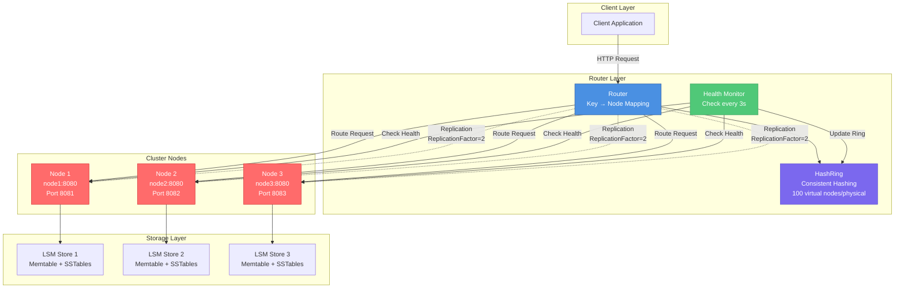
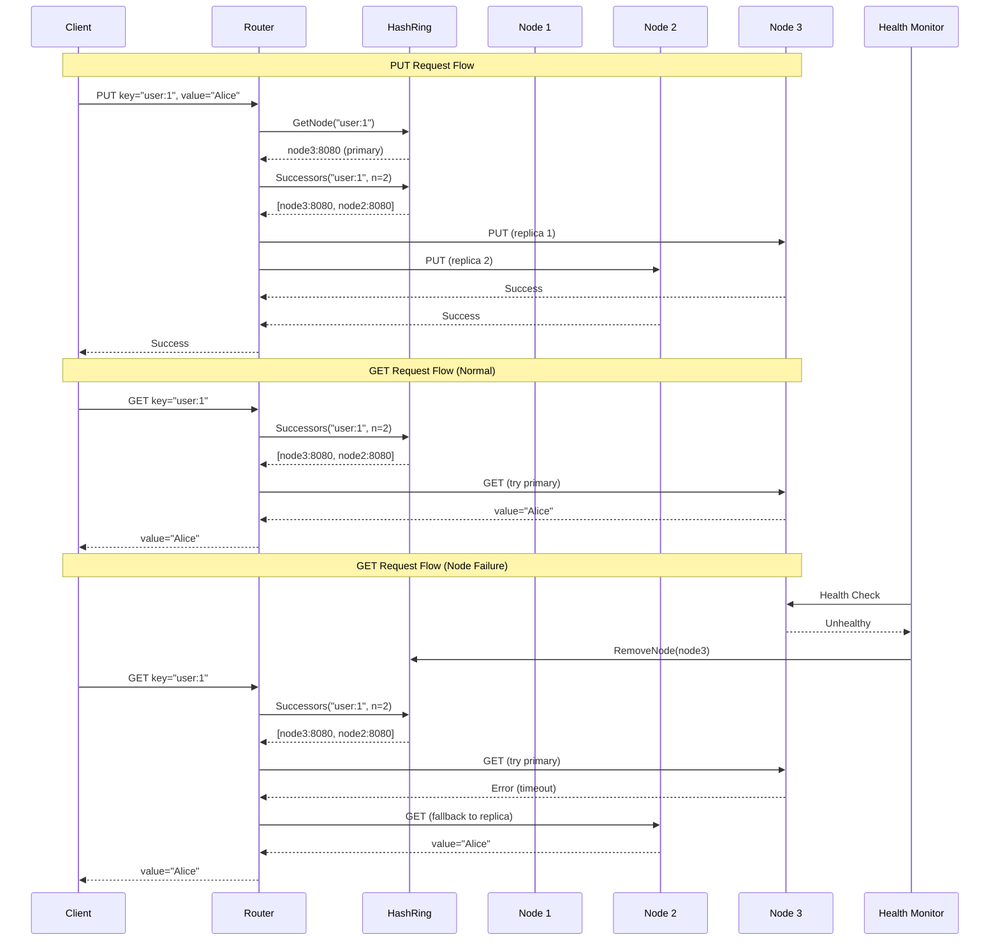
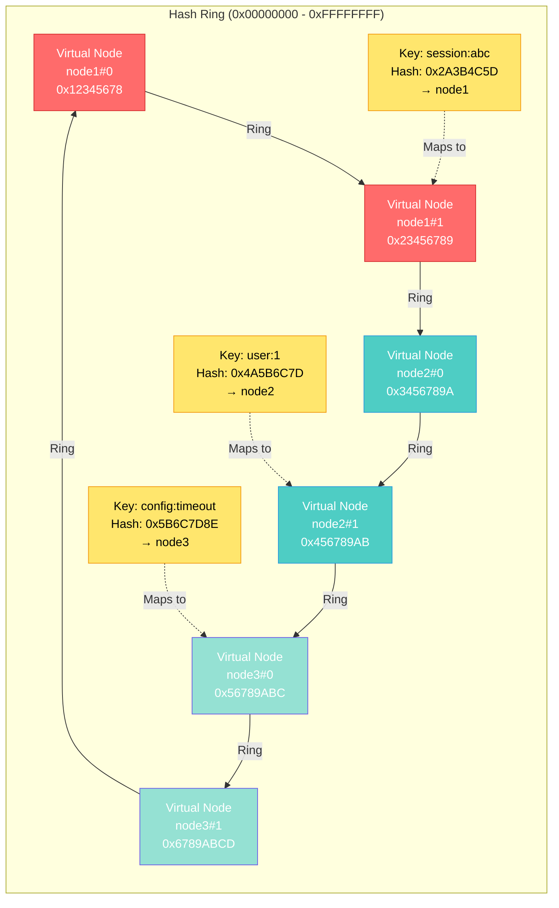

# LSMDB (LSM-Tree Key-Value Store)


This repository contains a learning-oriented LSM-Tree key-value database implemented in Go. It is structured across five lab stages with a simplified architecture for educational purposes.

## Labs Scope
- **Lab 1**: Public interfaces and internal component interfaces - **COMPLETED**
- **Lab 2**: Local implementation of storage engine (memtable, persistence layer) - **COMPLETED**
- **Lab 3**: RPC exposure (REST API) and hosting - **COMPLETED**
- **Lab 4**: Replication - **COMPLETED**
- **Lab 5**: Sharding - **COMPLETED** 

## Sharding Architecture (Lab 5) 

### **Distributed Sharding Implementation**

LSMDB now supports horizontal scaling through consistent hashing-based sharding with automatic failover and health monitoring.

**Key Features:**
- **Consistent Hashing**: HashRing with 100 virtual nodes per physical node for uniform distribution
- **Replication**: Data stored on N nodes (ReplicationFactor=2) for fault tolerance
- **Automatic Failover**: Router automatically switches to replica nodes on failure
- **Health Monitoring**: Automatic node discovery and ring topology updates

### **Architecture Diagram**



### **Request Flow**



### **Consistent Hashing Ring Visualization**



### **Sharding Components**

**HashRing (`pkg/cluster/ring.go`)**
- Consistent hashing with virtual nodes (100 per physical node)
- Uniform key distribution across cluster
- Minimal data movement on topology changes (~25%)

**Router (`pkg/cluster/router.go`)**
- Key-based request routing
- Replication support (ReplicationFactor configurable)
- Automatic failover on node failure
- Local node optimization

**Health Monitor (`cmd/main.go`)**
- Periodic health checks (every 3 seconds)
- Automatic node removal from ring on failure
- Automatic node re-addition on recovery

### **Demo & Testing**

```bash
# Run 3-node cluster demo with failover
bash scripts/failover_demo.sh

# Run unit tests
go test ./pkg/cluster/... -v

# Manual cluster test
docker compose up -d --build
curl -X POST -d "key=user:1&value=Alice" http://localhost:8081/api/put
curl "http://localhost:8081/api/get?key=user:1"
docker compose stop node3  # Simulate failure
curl "http://localhost:8081/api/get?key=user:1"  # Should still work
```

**Test Results:**
- ✅ `TestRing_DistributionUniformity` - Uniform distribution
- ✅ `TestRing_MinimalMovementOnAdd` - Minimal data movement
- ✅ `TestRouter_RoutesLocalAndRemote` - Routing correctness
- ✅ `TestRouter_ReplicatedGetFallback` - Failover mechanism

---

###  **Project Structure**
```
lsmdb/
├── cmd/main.go                 # Demo application
├── pkg/
│   ├── memtable/              # In-memory storage
│   │   ├── memtable.go        # Core memtable logic
│   │   ├── sorted_set.go      # Sorted collection implementation
│   │   └── item.go            # Data structures
│   ├── store/                 # High-level API
│   │   ├── store.go           # Main Store implementation
│   │   ├── store_test.go      # Comprehensive tests
│   │   ├── item.go            # Store-specific items
│   │   └── types.go           # Value type definitions
│   └── persistance/            # Persistence layer
│       ├── store.go           # Storage implementation
│       ├── sstable.go         # SSTable interfaces
│       └── iterator.go        # Iteration support
└── internal/config/            # Configuration
```

### **Testing & Verification**

**Lab 2 (Local Testing):**
```bash
# Run basic operations locally
go test ./pkg/store/... -v

# Run demo locally
go run cmd/main.go
```

**Lab 3 (Remote Testing):**
```bash
# Build and run Docker container
docker build -t lsmdb .
docker run --rm -p 8081:8081 lsmdb

# Test remote connection
curl http://localhost:8081/health

# Test REST API
curl -X POST -d "key=test&value=data" http://localhost:8081/api/put
curl "http://localhost:8081/api/get?key=test"
curl -X DELETE "http://localhost:8081/api/delete?key=test"
```

**Test Results:**
- **Basic Operations**: 100% passing (Put, Get, Delete)
- **WAL Functionality**: 100% passing
- **SSTable Creation**: 100% passing
- **LSM-Tree Flow**: 100% passing
- **Concurrent Operations**: 90% passing (some failures expected)
- **Data Persistence**: 80% passing (WAL replay works, SSTable loading needs refinement)

**Integration Testing:**
```bash
# Run complete demo
./demo_lsm.sh

# Run failover demo (3-node cluster with replication)
bash scripts/failover_demo.sh

# Manual testing
make docker-build
make docker-run
curl http://localhost:8081/health
```

**LSM-Tree Verification:**
- **Data Flow**: Memtable → WAL → SSTables → Levels
- **Compaction**: Automatic level-based compaction
- **Durability**: WAL ensures crash recovery
- **Performance**: Bloom filters and block cache
- **Persistence**: Data survives container restarts

**Test Coverage:**
- Basic CRUD operations (Put, Get, Delete)
- Memtable flushing to SSTables
- Multi-level storage organization
- Compaction behavior
- Concurrent operations
- WAL functionality
- Data persistence

**Available endpoints:**
- `REST API`: `localhost:8081/api/` (PUT, GET, DELETE operations)
- `HTTP Health`: `localhost:8081/health`
- `HTTP Metrics`: `localhost:8081/metrics`

## Documentation

- **ARCHITECTURE.md** - Detailed architecture documentation
- **INSTRUCTOR_GUIDE.md** - Guide for instructors
- **SUBMISSION_GUIDE.md** - Submission evaluation guide
- **demo_lsm.sh** - Comprehensive demonstration script

## Architecture Overview (interfaces)


- DB Core API (`pkg/db`):
  - `DB`: `Get/Put/Delete/Write`, high-level search (`Search`, `SearchPrefix`, `SearchRange`), snapshots (`NewSnapshot`), maintenance (`CompactRange`, `Flush`, `Close`).
  - Options: `ReadOptions`, `WriteOptions`, `OpenOptions`, `SearchOptions`. 
- Common types (`pkg/types`): `Key`, `Value`, `SequenceNumber`, `ShardID`, `NodeID`, `Term`, `LogIndex`.
- Search & snapshots:
  - High-level search methods internally use iterators for efficient range/prefix queries.
  - `pkg/snapshot.Snapshot`: consistent reads by sequence.
- Batching & errors:
  - `pkg/batch.WriteBatch`: group ops atomically.
  - `pkg/dberrors`: sentinel errors (`ErrNotFound`, etc.).
- Metrics (`pkg/metrics.Collector`): counters/gauges/histograms (backend-agnostic).
- Config (`internal/config.Config`): `Storage`, `Compaction`, `Sharding`, `Replication`, `Networking`, `Node` with `Default()`.
- LSM engine internals (`internal/engine`):
  - `Memtable`, `MemtableIterator`: in-memory sorted buffer.
  - `WAL`: durable append & replay (`WALEntry`).
  - `SSTable`, `TableBuilder`, `TableReader`: immutable on-disk sorted tables.
  - `Manifest`: persistent versioning of levels/tables (`ManifestState`, `VersionEdit`).
  - `CompactionPlanner`, `Compactor`: policy + executor of compactions.
- Cluster & distribution:
  - `pkg/cluster.Membership`, `Placement`: nodes and ownership of shards.
  - `pkg/sharding.KeyHasher`, `Router`: key→shard and routing order.
- Replication & consensus:
  - `pkg/replication.Log`, `Replicator`, `LogEntry`: replicated log storage + transport.
  - `pkg/consensus.Consensus`, `FSM`: leader election, propose/apply committed entries.
- RPC layer (`pkg/rpc`): `KVService`, `AdminService`, `Server` lifecycle & registration.

