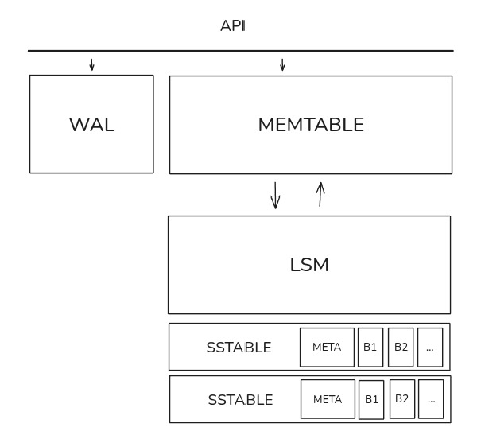
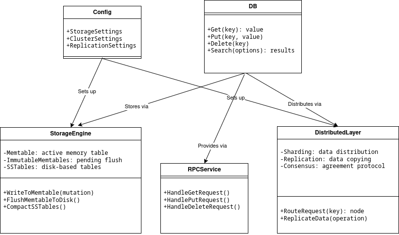

# LSMDB (LSM-Tree Key-Value Store)



This repository contains a learning-oriented LSM-Tree key-value database implemented in Go. It is structured across five lab stages with a simplified architecture for educational purposes.
---

## Project Scope & Lab Status

| Lab       | Topic                                    | Status          |
| --------- | ---------------------------------------- | --------------- |
| Lab 1     | Public interfaces, basic architecture    | ✅ Completed     |
| Lab 2     | Storage engine (Memtable, WAL, SSTables) | ✅ Completed     |
| Lab 3     | REST API & networking                    | ✅ Completed     |
| **Lab 4** | **Replication with Raft**                | ✅ **Completed** |
| **Lab 5** | **Sharding & distributed routing**       | ✅ **Completed** |

Labs 4 and 5 are implemented together as a **replicated Raft cluster with distributed request routing**.

---

## High-Level Architecture

```
Client
  │
  ▼
HTTP API (REST)
  │
  ▼
Router ──► Leader (Raft)
   │          │
   │          ▼
   │      Replicated Log
   │          │
   ▼          ▼
Followers ◄── Apply Entries
```

**Key properties:**

* Single leader per Raft group
* Followers redirect write requests (HTTP 307)
* Reads are served by all nodes
* Automatic leader re-election on failure
* Log replay and state catch-up on recovery

---

## LSM-Tree Storage Engine

Implemented across Labs 1–3.

**Components:**

* **Memtable** — in-memory sorted structure
* **WAL** — write-ahead log for durability
* **SSTables** — immutable on-disk tables
* **Bloom filters** — fast negative lookups
* **Compaction** — level-based merging

**Data flow:**

```
PUT → Memtable → WAL → SSTable → Compaction
```

---

## Raft-Based Replication (Lab 4)

Replication is implemented using the **Raft consensus algorithm**.

### Features:

* Leader election
* Log replication
* Commit & apply semantics
* Automatic failover
* State recovery after node restart

### Client behavior:

* **PUT / DELETE**:

  * Sent to leader
  * Followers respond with `307 Temporary Redirect`
* **GET**:

  * Served by any node

---

## Sharding and Request Routing (Lab 5)

Sharding in LSMDB is implemented using **Consistent Hashing** and a centralized **Router** component.
The goal of sharding is to evenly distribute keys across nodes while minimizing key movement during topology changes.

### High-Level Flow

```
Client
  │
  ▼
Router
  │
  ▼
Consistent Hash Ring
  │
  ▼
Shard Owner Node (Raft leader)
```

Each incoming request follows this pipeline:

```
key → hash(key) → shard → responsible node → local or remote execution
```

---

### Consistent Hash Ring

The hash ring is implemented with the following properties:

* Each physical node owns multiple **virtual nodes**
* Keys are mapped clockwise to the nearest virtual node
* Node join/leave causes minimal key redistribution
* Load is evenly balanced across nodes

Mapping logic:

```
shard = hash(key) mod ring_size
```

This allows:

* predictable key placement
* horizontal scalability
* graceful rebalancing on node failures

---

### Router Logic

The **Router** is responsible for deciding where a request should be executed.

For each operation (`PUT`, `GET`, `DELETE`):

1. Compute shard ID using consistent hashing
2. Determine responsible node for the shard
3. If shard is local → execute locally
4. If shard is remote → forward request to target node
5. For write operations:

   * if node is follower → return `307 Temporary Redirect`
   * client retries on leader

Example routing log:

```
[router] PUT key=user:42 → shard=3 → node2 (remote)
[router] GET key=user:42 → shard=3 → node1 (local)
```

---

### Interaction with Raft Replication

Sharding and replication are **orthogonal mechanisms**:

* **Sharding** determines *which node group owns the key*
* **Raft** ensures *replicated consistency inside that group*

In the current implementation:

* Each key is routed to exactly one shard
* Each shard is replicated using Raft
* Writes go through the shard leader
* Reads can be served by any replica

This separation allows:

* clean architecture
* independent scaling of shards
* fault tolerance at shard level

---

## REST API

### Endpoints

| Method | Endpoint                | Description          |
| ------ | ----------------------- | -------------------- |
| PUT    | `/api/string`           | Insert or update key |
| GET    | `/api/string?key=...`   | Retrieve value       |
| DELETE | implementation-specific | Delete key           |
| GET    | `/health`               | Node health check    |

**Redirect example:**

```
HTTP/1.1 307 Temporary Redirect
Location: http://localhost:8081/api/string
```

---

## Running the Cluster

### Build & start 3-node cluster

```bash
docker compose up -d --build
```

Nodes are exposed on:

* `http://localhost:8081`
* `http://localhost:8082`
* `http://localhost:8083`

---

## Automated Demo Scenario (Main Entry Point)

### showcase.sh — **primary demo script**

This script fully automates the demonstration required for submission.

```bash
chmod +x showcase.sh
./showcase.sh host
```

### What the showcase demonstrates:

1. Cluster startup
2. Health check on all nodes
3. Leader detection
4. PUT request handling
5. Redirect from follower to leader
6. GET from all nodes
7. DELETE operation
8. Leader failure (container stop)
9. Leader re-election
10. Continued availability of data
11. Node recovery and log catch-up
12. Quorum loss test (2 of 3 nodes down)
13. Cluster behavior without quorum (writes blocked)
14. Quorum restoration and cluster recovery

This script is **safe to run from host** and does not rely on internal Docker DNS.

---

## Failure Handling Example

```bash
docker compose stop node1
```

Expected behavior:

* New leader is elected
* Writes continue via new leader
* Reads remain available
* Restarted node replays log and catches up

---

## Quorum and Cluster Recovery Conditions

### Quorum Requirements

LSMDB uses Raft consensus algorithm which requires a **majority (quorum)** of nodes to be available for the cluster to operate:

* **3-node cluster**: Requires at least **2 nodes** (majority of 3)
* **5-node cluster**: Requires at least **3 nodes** (majority of 5)
* General rule: `quorum = (N / 2) + 1` where N is total number of nodes

### Stable Leader Election Conditions

Leader election succeeds when:

1. **Majority of nodes are available** (quorum exists)
2. **Network connectivity** between majority nodes is stable
3. **Election timeout** is reached (default: ~1 second with ElectionTick=10, tick=100ms)

**Example (3-node cluster):**
* ✅ **1 node fails**: Quorum maintained (2/3), new leader elected, writes continue
* ❌ **2 nodes fail**: No quorum (1/3), cluster cannot accept writes, no new leader elected

### Cluster Recovery Limits

The cluster **CAN recover** when:

* **Quorum is restored**: Failed nodes come back online and majority is re-established
* **Network partitions heal**: Connectivity between majority nodes is restored
* **Leader failure with quorum**: New leader is elected automatically (typically within 1-2 seconds)

The cluster **CANNOT recover** when:

* **Quorum is permanently lost**: Majority of nodes are permanently unavailable
* **Split-brain scenario**: Network partition divides cluster into two equal-sized groups (e.g., 2-2 split in 4-node cluster)
* **All nodes fail simultaneously**: Complete cluster failure (requires manual intervention)

### Testing Scenarios

The `showcase.sh` script demonstrates:

1. **Single node failure** (1 of 3): ✅ Cluster continues operating
2. **Leader failure**: ✅ New leader elected, data remains available
3. **Quorum loss** (2 of 3): ❌ Cluster stops accepting writes
4. **Quorum restoration**: ✅ Cluster resumes normal operation

### Expected Behavior During Failures

| Scenario | Nodes Available | Quorum? | Writes | Reads | Leader Election |
|----------|----------------|---------|--------|-------|-----------------|
| Normal | 3/3 | ✅ Yes | ✅ Works | ✅ Works | ✅ 1 leader |
| 1 node down | 2/3 | ✅ Yes | ✅ Works | ✅ Works | ✅ New leader |
| 2 nodes down | 1/3 | ❌ No | ❌ Blocked | ⚠️ May work* | ❌ No leader |
| All nodes down | 0/3 | ❌ No | ❌ Blocked | ❌ Blocked | ❌ No leader |

*Reads may work from remaining node if data was previously replicated, but writes are blocked without quorum.

### Research Findings: Cluster Behavior Analysis

#### Leader Election Timing

Based on testing with 3-node cluster:

* **Normal election**: ~0.5-1.5 seconds after leader failure
* **With network delays**: Up to 2-3 seconds
* **Quorum loss**: No election occurs (cluster remains leaderless)

#### Conditions for Stable Leader Re-election

✅ **Stable re-election occurs when:**
1. Majority of nodes (2/3) remain available
2. Network connectivity is stable between remaining nodes
3. Remaining nodes can communicate within election timeout

❌ **Re-election fails when:**
1. Less than majority available (1/3 or 0/3)
2. Network partition isolates nodes
3. All nodes fail simultaneously

#### Cluster Recovery Conditions

**Cluster CAN recover:**
* When quorum is restored (failed nodes come back online)
* When network partitions heal
* When nodes restart and can communicate with majority

**Cluster CANNOT recover automatically:**
* When quorum is permanently lost (majority nodes permanently unavailable)
* In split-brain scenarios with equal-sized partitions
* Requires manual intervention to restore quorum

#### Data Durability

* **WAL (Write-Ahead Log)**: All writes are persisted to disk before acknowledgment
* **Raft Log**: Currently uses in-memory storage (MemoryStorage) - state is recovered via WAL replay
* **Recovery**: Nodes replay WAL on restart to restore state, then catch up with Raft log from leader

**Note**: For production use, persistent Raft log storage would be recommended for complete state recovery.

---

## Demo Client (Replication & Sharding Test)

In addition to the automated `showcase.sh`, the project provides a demo client for manual testing of sharding and replication behavior.

### Running demo with replication factor

```bash
DEMO_NODES="http://localhost:8081,http://localhost:8082,http://localhost:8083" DEMO_RF=2 \
go run ./cmd/demo http://localhost:8081
```

Where:

* `DEMO_RF` — replication factor (number of replicas per key)
* `http://localhost:8081` — entry node (router)

---

## Project Structure

```
lsmdb/
├── cmd/
│   ├── main.go          # Node entrypoint
│   └── demo/            # Legacy demo client (optional)
├── pkg/
│   ├── memtable/        # In-memory storage
│   ├── cluster/         # Router & HashRing 
│   ├── rpc/             # REST API
│   ├── store/           # High-level KV interface
│   ├── raftadapter/     # Raft integration
│   └── persistence/     # WAL & SSTables
├── showcase.sh          # Automated cluster demo
├── docker-compose.yml
└── README.md
```

---

## Documentation

- **ARCHITECTURE.md** - Detailed architecture documentation
- **INSTRUCTOR_GUIDE.md** - Guide for instructors
- **SUBMISSION_GUIDE.md** - Submission evaluation guide

---

## Architecture Overview (Current Implementation)

* **Storage API (`pkg/store`)**
  * `Store`: core operations `Put`, `Get`, `Delete`
  * Acts as a façade over the LSM-Tree engine
  * Used both locally and via the RPC layer
* **Common data model**
  * Keys and values are handled as strings
  * Node identity and leadership are managed at the cluster / Raft level
* **LSM-Tree internals**
  * **Memtable** (`pkg/memtable`)
    * In-memory sorted data structure
    * Flushes to disk when size threshold is reached
  * **WAL (Write-Ahead Log)** (`pkg/persistence`)
    * Ensures durability of write operations
    * Replayed on node restart
  * **SSTables** (`pkg/persistence`)
    * Immutable on-disk sorted tables
    * Indexed reads for efficient lookups
  * **Compaction**
    * Level-based compaction strategy
    * Merges SSTables to reduce read amplification
* **Networking & RPC (`pkg/rpc`)**
  * HTTP REST API:
    * `PUT /api/string`
    * `GET /api/string?key=...`
    * `DELETE` (endpoint depends on implementation)
  * `GET /health` for node liveness checks
  * HTTP server lifecycle and handler registration
* **Sharding & Request Routing (`pkg/cluster`)**
  * **Consistent Hashing**
    * Key → hash → shard
    * Virtual nodes used for load balancing
  * **Router**
    * Determines shard ownership
    * Executes requests locally or forwards them to remote nodes
    * Entry point for all client operations
* **Replication & Consensus (Raft)**
  * Leader-based replication model
  * All write operations go through the leader
  * Followers:
    * serve read requests, or
    * return `307 Temporary Redirect` to the leader
  * Implemented features:
    * leader election
    * log replication
    * failover handling
    * state recovery after restart
* **Cluster Execution**
  * One Docker container = one LSMDB node
  * Multi-node cluster launched via `docker-compose`
  * Supports:
    * leader failure
    * automatic re-election
    * log replay and state catch-up
* **Demo & Testing**
  * `showcase.sh`
    * Fully automated demo:
      * leader election
      * redirect handling
      * CRUD operations
      * failover
      * recovery
  * `cmd/demo`
    * Manual sharding & replication demo
    * Supports configurable replication factor via `DEMO_RF`
