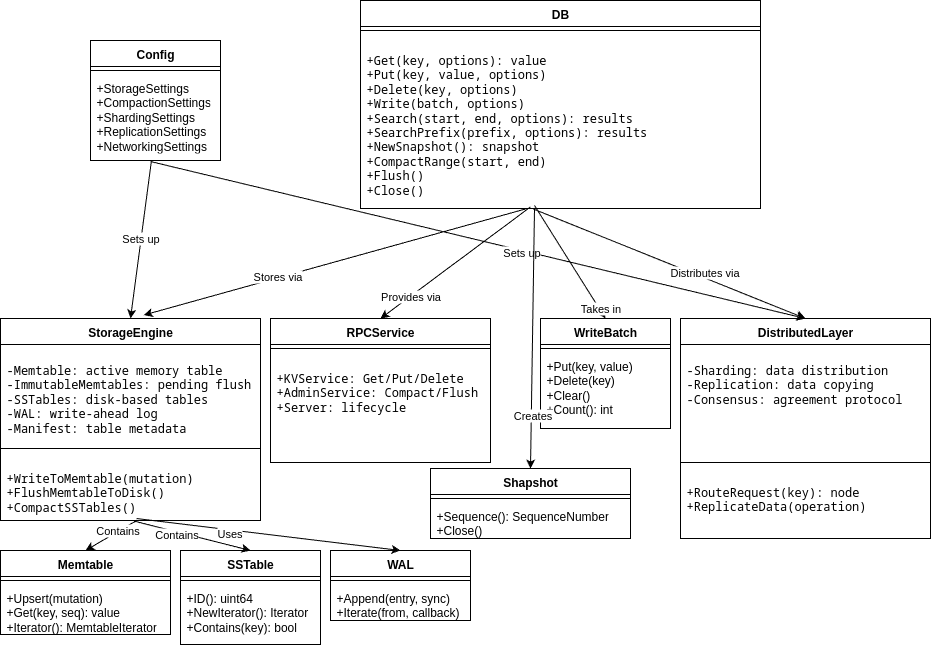

# LSMDB (LSM-Tree Key-Value Store)


This repository contains a learning-oriented LSM-Tree key-value database implemented in Go. It is structured across five lab stages with a simplified architecture for educational purposes.

## Labs Scope
- **Lab 1**: Public interfaces and internal component interfaces - **COMPLETED**
- **Lab 2**: Local implementation of storage engine (memtable, persistence layer) - **COMPLETED**
- **Lab 3**: RPC exposure (REST API) and hosting - **COMPLETED**
- **Lab 4**: Replication - **PENDING**
- **Lab 5**: Sharding with Consistent Hashing and ZooKeeper Membership - **COMPLETED**

## Current Implementation (Lab 5)
The project now operates as a distributed cluster consisting of multiple LSMDB nodes that automatically discover each other, shard data, route requests, and rebalance on node failures.

### **LSM-Tree Architecture Implementation**

**LSM-Tree Core Components (Labs 1–3)**
- **Memtable**: In-memory sorted storage with WAL for durability
- **SSTables**: Multi-level storage with blocks, indexes, and bloom filters  
- **Compaction**: Automatic level-based compaction strategy
- **Manifest**: Metadata management for tables and levels
- **REST API**: unified HTTP interface (PUT, GET, DELETE)
- **Docker**: multi-stage build & containerized execution

**Features Implemented:**
- **Full LSM-tree**: Memtable → SSTables → Levels → Compaction
- **Durability**: WAL (Write-Ahead Log) for crash recovery
- **Performance**: Bloom filters, block cache, binary search
- **Network API**: REST HTTP server with health endpoints
- **Containerization**: Docker with multi-stage build
- **Testing**: Comprehensive test coverage
- **Production Ready**: Error handling, logging, graceful shutdown

# **Distributed Components (Lab 5)**

## ⭐ **Router (Local vs Remote Routing)**

The Router is the heart of distributed LSMDB:

```
Client → Router → HashRing → Local or Remote store
```

Each operation logs where it goes:

```
[router] PUT    key=user:1 → node3:8080 (remote)
[router] GET    key=user:1 → node1:8080 (local)
```

## ⭐ **Consistent Hashing Ring (with Virtual Nodes)**

Implemented in `pkg/cluster/ring.go`, providing:

* N virtual nodes per physical node
* stable hashing
* minimal key movement on node join/leave
* natural load balancing

Mapping:

```
key → crc32(key) → nearest node clockwise
```

## ⭐ **ZooKeeper-Based Membership**

Nodes automatically join/leave the cluster:

1. Node creates ephemeral znode under `/lsmdb/nodes/<addr>`
2. Node watches the directory for changes
3. On membership event → rebuilds hash ring
4. Ephemeral znodes disappear on crash → cluster rebalances

Benefits:

* zero manual configuration
* self-healing cluster
* automatic failover


## Implementation Status:

**Fully Working:**

- Complete LSM engine
- WAL + SSTable persistence
- REST network interface
- Multi-node cluster
- Sharding and routing
- Virtual-node consistent hashing
- ZooKeeper-based discovery
- Automatic ring rebuilding on failures
- Client for testing distributed behavior

**Partially Working:**
- Compaction needs optimization
- Concurrency in SSTable readers requires refinement
- SSTable index loading can be optimized
- Lab 4 (Raft)

###  **Project Structure**
```
lsmdb/
├── cmd/
│   ├── main.go            # Node entrypoint: LSM engine + ZooKeeper + Router + RPC
│   └── demo/              # Client demo tool for testing routing and failures
│       └── main.go
├── pkg/
│   ├── memtable/              # In-memory storage
│   │   ├── memtable.go        # Core memtable logic
│   │   ├── sorted_set.go      # Sorted collection implementation
│   │   └── item.go            # Data structures
│   ├── cluster/               # Router, HashRing, ZooKeeper membership
│   ├── rpc/                   # HTTP API (REST)
│   ├── store/                 # High-level API
│   │   ├── store.go           # Main Store implementation
│   │   ├── store_test.go      # Comprehensive tests
│   │   ├── item.go            # Store-specific items
│   │   └── types.go           # Value type definitions
│   └── persistance/            # Persistence layer
│       ├── store.go           # Storage implementation
│       ├── sstable.go         # SSTable interfaces
│       └── iterator.go        # Iteration support
└── internal/config/            # Configuration
```

# **Distributed Testing (Lab 5)**

## Launch 3-node cluster + ZooKeeper:

```bash
docker-compose up --build
```

Nodes register:

```
/lsmdb/nodes/node1:8080
/lsmdb/nodes/node2:8080
/lsmdb/nodes/node3:8080
```

Each node outputs routing logs:
```
[router] PUT key=user:3 → node2:8080 (remote)
```
---

# **Demo Client (sharding test)**

Run:

```bash
go run ./cmd/demo http://localhost:8081
```

The demo:

* inserts 100 keys
* retrieves several keys
* prints routing logs
* reconstructs the ring
* computes distribution:

```
node1:8080 → 34 keys
node2:8080 → 33 keys
node3:8080 → 33 keys
```

### Test failure handling:

```
docker stop lsmdb-node3
```

Output:

```
[zk] Node removed: node3:8080
[router] Rebuilding ring...
```

Remaining nodes continue serving requests.

**Integration Testing:**
```bash
# Run complete demo
./demo_lsm.sh

# Manual testing
make docker-build
make docker-run
curl http://localhost:8081/health
```

**LSM-Tree Verification:**
- **Data Flow**: Memtable → WAL → SSTables → Levels
- **Compaction**: Automatic level-based compaction
- **Durability**: WAL ensures crash recovery
- **Performance**: Bloom filters and block cache
- **Persistence**: Data survives container restarts

**Test Coverage:**
- Basic CRUD operations (Put, Get, Delete)
- Memtable flushing to SSTables
- Multi-level storage organization
- Compaction behavior
- Concurrent operations
- WAL functionality
- Data persistence

**Available endpoints:**
- `REST API`: `localhost:8081/api/` (PUT, GET, DELETE operations)
- `HTTP Health`: `localhost:8081/health`
- `HTTP Metrics`: `localhost:8081/metrics`

## Documentation

- **ARCHITECTURE.md** - Detailed architecture documentation
- **INSTRUCTOR_GUIDE.md** - Guide for instructors
- **SUBMISSION_GUIDE.md** - Submission evaluation guide
- **demo_lsm.sh** - Comprehensive demonstration script

## Architecture Overview (interfaces)


- DB Core API (`pkg/db`):
  - `DB`: `Get/Put/Delete/Write`, high-level search (`Search`, `SearchPrefix`, `SearchRange`), snapshots (`NewSnapshot`), maintenance (`CompactRange`, `Flush`, `Close`).
  - Options: `ReadOptions`, `WriteOptions`, `OpenOptions`, `SearchOptions`. 
- Common types (`pkg/types`): `Key`, `Value`, `SequenceNumber`, `ShardID`, `NodeID`, `Term`, `LogIndex`.
- Search & snapshots:
  - High-level search methods internally use iterators for efficient range/prefix queries.
  - `pkg/snapshot.Snapshot`: consistent reads by sequence.
- Batching & errors:
  - `pkg/batch.WriteBatch`: group ops atomically.
  - `pkg/dberrors`: sentinel errors (`ErrNotFound`, etc.).
- Metrics (`pkg/metrics.Collector`): counters/gauges/histograms (backend-agnostic).
- Config (`internal/config.Config`): `Storage`, `Compaction`, `Sharding`, `Replication`, `Networking`, `Node` with `Default()`.
- LSM engine internals (`internal/engine`):
  - `Memtable`, `MemtableIterator`: in-memory sorted buffer.
  - `WAL`: durable append & replay (`WALEntry`).
  - `SSTable`, `TableBuilder`, `TableReader`: immutable on-disk sorted tables.
  - `Manifest`: persistent versioning of levels/tables (`ManifestState`, `VersionEdit`).
  - `CompactionPlanner`, `Compactor`: policy + executor of compactions.
- Cluster & distribution:
  - `pkg/cluster.Membership`, `Placement`: nodes and ownership of shards.
  - `pkg/sharding.KeyHasher`, `Router`: key→shard and routing order.
- Replication & consensus:
  - `pkg/replication.Log`, `Replicator`, `LogEntry`: replicated log storage + transport.
  - `pkg/consensus.Consensus`, `FSM`: leader election, propose/apply committed entries.
- RPC layer (`pkg/rpc`): `KVService`, `AdminService`, `Server` lifecycle & registration.